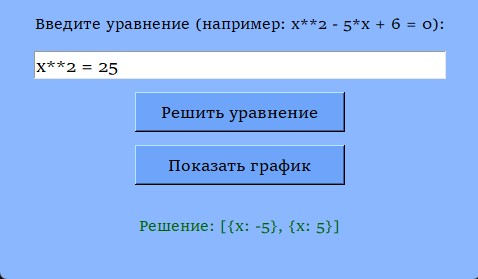
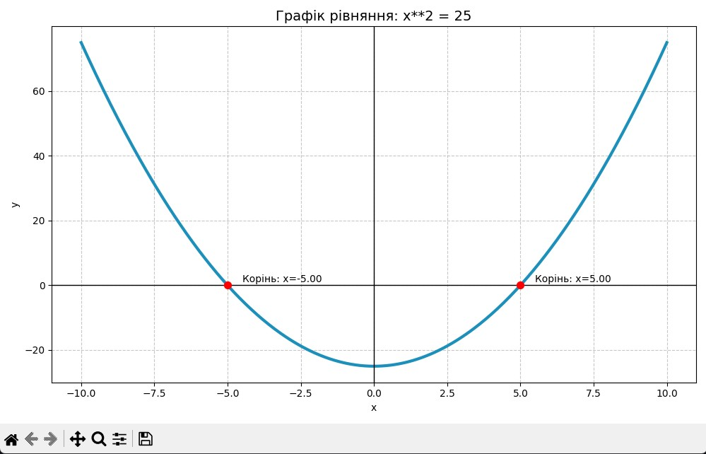
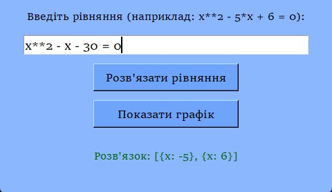
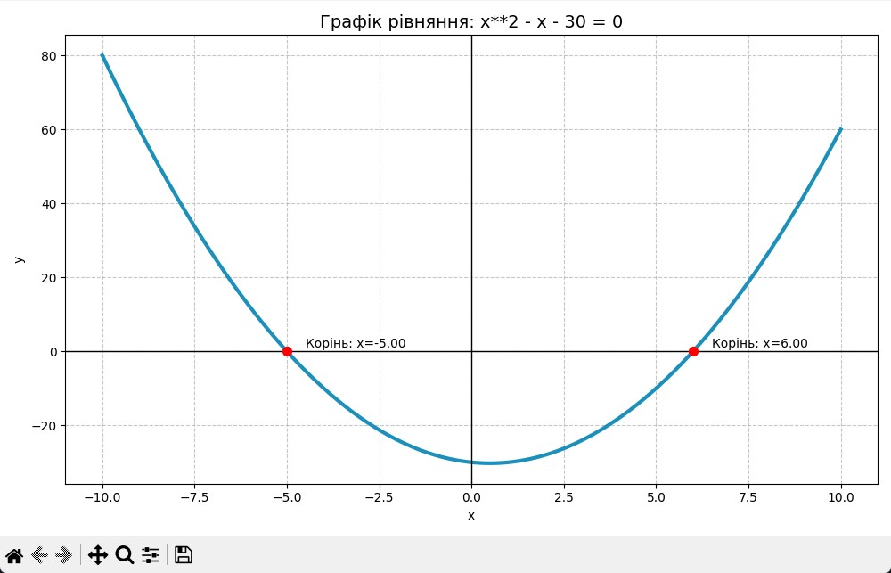

# Решатель уравнений + Построитель графиков

**Интерактивная программа** для решения уравнений и мгновенного построения графиков.


## Возможности

- Решение линейных и квадратичных уравнений
- Автоматическо
е построение графика функции
- Поиск и отображение корней на графике
- Удобный графический интерфейс (Tkinter)
- Красивые и понятные графики

## Примеры работы

**Ввод:** `x**2 = 25`  
**Результат:** `x = -5`, `x = 5` + график параболы с отмеченными корнями

**Ввод:** `x**2 - x - 30 = 0`  
**Результат:** `x = -5`, `x = 6` + график параболы с отмеченными корнями

## Скриншоты





## Как запустить

1. Установи Python 3.10+
2. Установи библиотеки:
   ```bash
   pip install sympy matplotlib numpy
3. Скачай файл `main.py`
4. Запусти:
   ```bash
   python main.py
